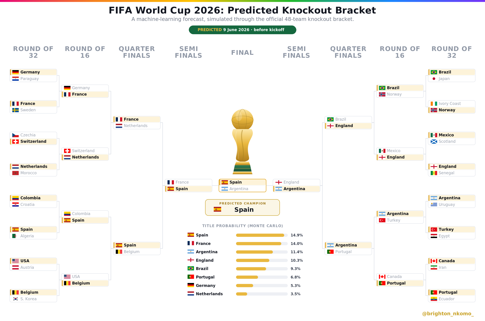

# World Cup Model



A calibrated machine-learning model for the FIFA World Cup. It rates national
teams from forward-in-time **Elo** and **EA FC / FIFA squad strength**, fits a
calibrated multinomial model for home/draw/away, and runs a **Monte-Carlo**
simulation of the tournament to produce round-by-round advancement and title
odds. It backtests on the 2018 and 2022 World Cups and forecasts the 48-team
2026 bracket, updating live as matches are played.

The guiding principle is **calibration over accuracy**: a model that is right
55% of the time with trustworthy probabilities is more useful than one that is
right 58% of the time but overconfident. Every metric is reported on a
temporally-correct split (train on the past, test on a later tournament), and no
feature uses information that would not exist 60 seconds before kickoff.

## What is inside

| Path | Contents |
| --- | --- |
| `src/worldcup/` | The engine: Elo, features, model, simulation, squads, live update, poster. |
| `src/analysis/evaluation.py` | Log-loss, Brier, RPS, accuracy, and the baseline probabilities. |
| `notebooks/01_EDA.ipynb` | Exploratory analysis: what the match, rating, and squad data contain. |
| `notebooks/02_hypothesis_tests.ipynb` | Every hypothesis tested, with a null, an alpha = 0.05 test, and a verdict. |
| `notebooks/03_api_check.ipynb` | Live API check: results, fixtures, and the fields available to use. |
| `notebooks/worldcup_report.ipynb` | The end-to-end modelling report. (Withheld for now) |
| `.devcontainer/` | Docker dev container (Python 3.11 + cairo) for a one-click environment. |
| `tests/test_worldcup.py` | Deterministic unit tests for the engine. |
| `_processed_outputs/worldcup/` | Generated results: metrics, predictions, simulations, posters. |
| `data/raw/` | Match history, World Cup data, confirmed squads, flags. |

## How the model works

1. **Elo** (`elo.py`) rates every nation by replaying all international results
   forward in time, with the K-factor scaled by competition importance, a
   goal-difference multiplier, and a host-only home advantage.
2. **Squad strength** (`features.py`, `team_strength.py`, `squads.py`) summarises
   each nation's EA FC / FIFA ratings (top-23, goalkeeper, defence, midfield,
   attack). For 2026 the confirmed 26-man squads are matched to EA FC 26;
   nations EA FC does not cover fall back to a nationality-pool proxy.
3. **Model** (`model.py`) fits a multinomial logistic regression on the rating
   differences, symmetrised so orientation carries no signal, and calibrated
   with sigmoid (Platt) scaling on a temporal tail.
4. **Simulation** (`simulate.py`, `worldcup2026.py`) Monte-Carlos the group stage
   and knockouts (the 2026 bracket follows the official FIFA Annex C
   third-place allocation) to produce title odds.
5. **Live update** (`live.py`) folds played 2026 results into Elo, locks the real
   group points, and re-forecasts the remaining bracket.

## Main commands

Set up the environment, then run any of the targets below.

```bash
# Option A - Docker dev container (recommended): open the folder in VS Code and
# choose "Reopen in Container". Everything below is then ready to run.

# Option B - local virtualenv:
python -m venv .venv && source .venv/bin/activate
pip install -e .[dev]
```

```bash
# Forecasting and backtests
python -m src.worldcup.run            # backtest the 2018 and 2022 World Cups
python -m src.worldcup.run_2026       # forecast the 48-team 2026 bracket
python -m src.worldcup.live           # fold in played 2026 results, re-forecast
python -m src.worldcup.defense_study  # the "does defence win titles" study

# Checks
pytest                                 # run the unit tests
```

```bash
# Notebooks (run top-to-bottom)
jupyter notebook notebooks/03_api_check.ipynb    # is the API up; results and fixtures
jupyter notebook notebooks/01_EDA.ipynb          # what the data contains
jupyter notebook notebooks/02_hypothesis_tests.ipynb   # which features worked, with tests
```

The live update and the API-check notebook need `FOOTBALL_DATA_API_KEY` in `.env`
(copy `.env.example`); without it they fall back to the cached snapshot in
`data/raw/footballdata_api/`.

## Data

Match history (martj42 internationals, jfjelstul World Cup data), the confirmed
2026 squads (football-data.org), and country flags ship in `data/raw/`. The EA
FC / FIFA player ratings (`data/raw/fifa/players_*.csv`) are **not** committed
because they are large and Kaggle-licensed; see `data/raw/fifa/README.md` for how
to supply them. API keys for the live update go in `.env` (template in
`.env.example`).
